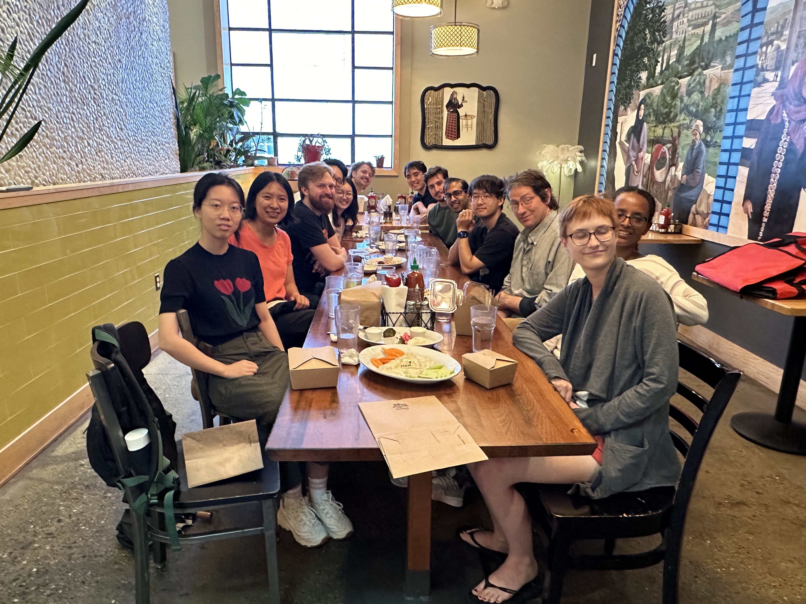

## Current Members

### Postdoctoral Fellows

* [Yiluan Song](https://scholar.google.com/citations?user=QToyeIAAAAAJ&hl=en), 2023-2025.
  Schmidt AI in Science Postdoc, Joint with [Kai Zhu](https://seas.umich.edu/research/faculty/kai-zhu).
* [Jingyang Li](https://scholar.google.com/citations?user=4Q2DaL4AAAAJ&hl=en), 2023-2025.
* [Tsige Atilaw](https://scholar.google.com/citations?user=AfjHc8EAAAAJ&hl=en), 2024-2026.
  Schmidt AI in Science Postdoc, Joint with [Mojtaba Akhavan-Tafti](https://clasp.engin.umich.edu/people/akhavan-tafti-mojtaba/).
* [Yian Yu](https://yyianyu.github.io/), 2025-2027.
* [Zhen Qin](https://zhenqin-robin.github.io/), 2025-2027.
  MICDE Postdoctoral Fellow, Joint with [Qing Qu](https://qingqu.engin.umich.edu/).

### Ph.D. Students

* Victor Verma, 2022-now, joint with [Stilian Stoev](https://sites.lsa.umich.edu/sstoev/).
* Yuxuan Ke, 2023-now.
* Jiuqian Shang, 2023-now.
* Noah Kochanski, 2023-now.
* Soham Das, 2024-now.
* Kevin Jin, 2024-now.
* Surtai Han, 2025-now.

---

## Photos

---

## Alumni

### Postdoc Alumni

* [Arya Farahi](https://afarahi.github.io/) (MIDAS data science fellow), 2019-2021.  
  First position: Assistant Professor at the University of Texas at Austin
  
### Ph.D. Alumni

* Wyane (Yu) Wang (joint with [Alfred O. Hero](https://hero.engin.umich.edu/)), 2018-2022.  
   - Dissertation title: *Interpretable and Scalable Graphical Models for Complex Spatio-temporal Processes.*  
   - First position after graduation: Researcher at Google.
* [Robert N. Trangucci](https://rtrangucci.github.io/) (joint with [Jon Zelner](https://sph.umich.edu/faculty-profiles/zelner-jon.html)), 2017-2023.
   - Dissertation title: *Bayesian Methods for Mitigating Sample Selection Bias in Epidemiology.*
   - First position after graduation: Assistant Professor of Statistics at Oregon State University.
* [Daniel Iong](https://danieliong.github.io/), 2017-2023.
   - Dissertation title: *Inference algorithms for probabilistic models with applications in epidemiology and space weather forecasting.* 
   - First position after graduation: Researcher at the Institute for Defense Analyses.
* Bach Viet Do (joint with [Long Nguyen](https://dept.stat.lsa.umich.edu/~xuanlong/)), 2017-2023.
   - Dissertation title: *Mixture Modeling: Solar Application and Misspecification Behaviors.*
   - First position after graduation: Research Data Scientist at Ford Motors. 
* [Hu Sun](https://husun0822.github.io/), 2020-2024.
  - Dissertation title: *Statistical Methods for Spatio-Temporal Tensor Data.*
  - First position after graduation: IMC Trading.

### Bridge Program Alumni

(name, years, first position)

* Dylan Glover, 2021-2022, Research Statistician at Maxar Technologies.
* Noah Kochanski, 2022-2023, Ph.D. student at University of Michigan.
* Mallory Wang, 2023 Winter, Ph.D. student at University of California, Santa Babara.

### Masters' Program Alumni (incomplete list)

(name, years, first position)

* Tian Zhou, 2018-2019, Machine Learning Engineer at Snap.
* Naomi Giertych, 2018-2019, Ph.D. student at North Carolina State University.
* Zhenbang Jiao, 2018-2020, Ph.D. student at The Ohio State University.
* Hu Sun, 2018-2020, Ph.D. student at the University of Michigan, Ann Arbor.
* Zhijun Hua, 2020-2021, Ph.D. student at Cornell University.
* Xianlin Sun, 2021-2022, Ph.D. student at University of Hong Kong.
* Hongfan Chen, 2021-2022, Ph.D. student at the University of Michigan, Ann Arbor.
* Wei Zhao, 2021-2022, Ph.D. student at North Carolina State University.
* Yurui Chang, 2022-2023, Ph.D. student at Penn State University.
* Zeyuan Li, 2023.
* Qikai Hu, 2022-2023, Ph.D. student at the University of Michigan, Ann Arbor.
* Ruoyang Liu, 2022-2023.
* Jiayin Ye, 2023-2024, joint with [Yi Hong](https://ciglr.seas.umich.edu/opportunities/postdoctoral-fellowships/yi-hong/), Ph.D. student at University of Maryland.
* Xinyu Liang, 2023-2024, joint with [Wenman Liu](https://www.researchgate.net/profile/Wenman-Liu-2).
* Yizhou Zhang, 2023 summer-2024, Ph.D. student at Purdue University.
* Matthew McAnear, 2023-2025, Ph.D. student at the University of Michigan.
* Ke Hu, 2024-2025, Ph.D. student at University of Illinois Urbana-Champaign.
* Chia-Yun Li, 2024-2025.
* Jiaxing Xu, 2024-2025.
* Ashlan Simpson, 2024-2025.

### Undergraduate Alumni

(name, years, first position)

* [Miaoshiqi Liu](https://shiqi.writingspace.cc/), 2018 summer, Ph.D. student at University of Toronto.
* [Song Wei](https://sites.google.com/view/songwei-gt/home), 2018 summer, Ph.D. student at Georgia Institute of Technology.
* Yuezhou Qu, 2023 Winter - 2024.
* Ruipu Li, 2022-2024, joint with [Joyce Penner](https://clasp.engin.umich.edu/people/penner-joyce-e/) and [Xianglei Huang](https://clasp.engin.umich.edu/people/huang-xianglei/), 2022 summer -2024, Ph.D. student at the University of Michigan.
* Nicolas Harder, 2022-2024, joint with [Joyce Penner](https://clasp.engin.umich.edu/people/penner-joyce-e/) and [Xianglei Huang](https://clasp.engin.umich.edu/people/huang-xianglei/), 2022 summer -2024.
* Brandon Li, 2023 Winter-2024, joint with [Yi Hong](https://ciglr.seas.umich.edu/opportunities/postdoctoral-fellowships/yi-hong/).
* Jiuqian Shang, 2022 summer - 2023 Winter, Ph.D. student at University of Michigan.
* Xiaoli Li, 2023 Winter - 2024, Ph.D. student at the University of Chicago.
* Xiaofan Xia, 2023 Summer, Ph.D. student at the University of Toronto.
* Qikai Shen, 2025 Winter (URPS program, with Ph.D. student Jiuqian Shang), Master's student at the University of Chicago.
* Qinkai Li, 2025 Winter (URPS program, with Ph.D. student Jiuqian Shang).
* Benjamin Tward, 2025 Winter (URPS program, with Ph.D. student Ashlan Simpson).
* Meghan Kunkle, 2025 Winter (URPS program, with Ph.D. student Ashlan Simpson).
